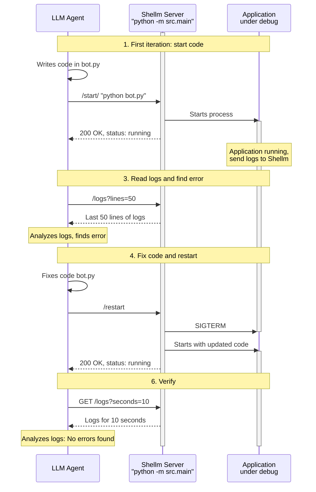

# Shellm: Terminal server for LLM agents

This is a simple thing, not an MCP server. The only thing it does is allow you to use the HTTP API to control a console in which some console-blocking process is running. 
If you write an application that runs and works by blocking the console — for example, a Telegram bot or something with HTTP — then a problem arises: the agent can run commands itself during development, write, run, check for errors, fix them, and run again. But if it needs to catch a piece of log that appears in a running process, things get more complicated: after running the command, it only receives the next call when the command is complete, and if it doesn't hang because the server is hanging on the process and processing data, the agent just waits.
 
Therefore, to debug such servers, you have to run them in a separate terminal and copy pieces of logs from there to the agent's chat.
Or, another example: MCU development. Some things can only be debugged in hardware, and communication with MCU occurs via UART. To view the logs from the MCU, you need to run some kind of serial monitor, but again, it will block the console and constantly write what the MCU sends to it, and to show this to the agent, you need to copy a piece of text from there and paste it into the agent's chat. It's inconvenient, manual work that has no value.

Shellm is a simple application that you run (manually) in the console, and then the agent communicates with it. It can tell it to "run this command," and then say "show me the last 20 lines of logs," find what it needs in those logs, fix the code, and then ask Shellm to restart the process.
 

## How works



**Key advantages:**
- 🔄 **Iterative development**: LLM can repeatedly start, check logs, and fix code
- 🚫 **Non-blocking mode**: agent is not blocked on command execution, can request logs at any time
- 📝 **Persistent log access**: all logs are saved and available for reading
- ⚡ **Fast feedback loop**: start → read logs → fix → restart


## Case: HTTP-server

```bash
curl -s -X POST http://localhost:8776/start -d 'cd ~/Data/Projects/ukuetis_logger_backend_v2 && source .venv/bin/activate && python main.py'
status: running
pid: 43675
uptime: 2s
command: cd ~/Data/Projects/ukuetis_logger_backend_v2 && source .venv/bin/activate && python main.py
user: vvzvlad
ports: -
cpu: 0.0
mem_mb: 1.796875
threads: 1
open_files: 0
connections: 0
children: 1
env_count: 0
```

```bash
curl -s 'http://localhost:8776/logs?lines=40' 
2026-02-16 10:31:14.769 | INFO     | uvicorn.error:_serve:84 - Started server process [43678]
2026-02-16 10:31:14.769 | INFO     | uvicorn.error:startup:48 - Waiting for application startup.
2026-02-16 10:31:14.769 | INFO     | main:lifespan:31 - === LIFESPAN STARTUP BEGIN ===
2026-02-16 10:31:14.769 | INFO     | main:lifespan:32 - Encryption key loaded: jhfhrhhfeffhy
2026-02-16 10:31:14.818 | INFO     | main:lifespan:34 - Database connected
2026-02-16 10:31:14.818 | INFO     | src.database:create_schema:106 - Applying database migrations
2026-02-16 10:31:14.876 | INFO     | src.migrations:apply_migrations:219 - Current database schema version: 5
2026-02-16 10:31:14.878 | INFO     | src.migrations:apply_migrations:258 - Database schema is up to date
2026-02-16 10:31:14.881 | INFO     | src.database:create_schema:111 - Database schema ready. Current version: 5
2026-02-16 10:31:14.881 | INFO     | main:lifespan:36 - Schema created
2026-02-16 10:31:14.881 | INFO     | main:lifespan:40 - Workers module imported successfully
2026-02-16 10:31:14.881 | INFO     | main:lifespan:47 - Workers scheduler task created and started
2026-02-16 10:31:14.881 | INFO     | main:lifespan:56 - Starting Telegram bot...
2026-02-16 10:31:14.881 | INFO     | bot:create_telegram_bot:228 - Bot init, token: 8461205005...
2026-02-16 10:31:14.890 | INFO     | main:lifespan:59 - Telegram bot started successfully
```

## Case: MCU debug

In the case of MK, he can say “reboot” and “output logs”: `platformio run --target upload --target monitor`,

```bash
curl -s -X POST http://localhost:8776/start -d ‘{“command”:“platformio run --target upload --target monitor”}’
```

and then

```bash
curl -s ‘http://localhost:8776/logs?lines=100’
```

As a result, the agent can debug software for MK completely independently — wrote a piece, assembled it, launched the firmware and monitor through this server, looked at the logs, killed the monitor, corrected the code, launched the assembly and firmware again, and looked at the logs again.


## Quick Start

```bash
pip install -r requirements.txt
python -m src.main
```

Check:

```bash
curl http://localhost:8776/health
```

## API

### POST /start

```bash
curl -X POST http://localhost:8776/start \
  -H "Content-Type: application/json" \
  -d '{"command": "python -m http.server 8080"}'
```

Note: after starting a command, the API waits ~2 seconds before responding to collect PID/status and catch early errors (for example, invalid folder paths).

By default, responses are plain text. For JSON, add `?format=json`.

### GET /status

```bash
curl http://localhost:8776/status
```

For JSON: `curl 'http://localhost:8776/status?format=json'`.

### POST /kill

```bash
curl -X POST 'http://localhost:8776/kill?type=SIGTERM'
```

For JSON: `curl -X POST 'http://localhost:8776/kill?type=SIGTERM&format=json'`.

### POST /restart

```bash
curl -X POST 'http://localhost:8776/restart?timeout=5'
```

For JSON: `curl -X POST 'http://localhost:8776/restart?timeout=5&format=json'`.

### GET /logs

```bash
curl 'http://localhost:8776/logs?lines=100'
curl 'http://localhost:8776/logs?seconds=30'
```

## TUI (split console into two panes)

Run the server in TUI mode (single command):

```bash
python -m src.main --tui
```

The bottom pane shows status (state, pid, uptime), the command, and hotkeys:
- `k` — SIGTERM
- `K` or `9` — SIGKILL

Additionally, the status shows process metrics (CPU/RAM/ports/user) via `psutil`.

## Features

- Only one process at a time
- Logs are written to `logs/` in JSON format
- `shell=True` to support `cd`, variables, and pipes
- `lines` and `seconds` cannot be used together
