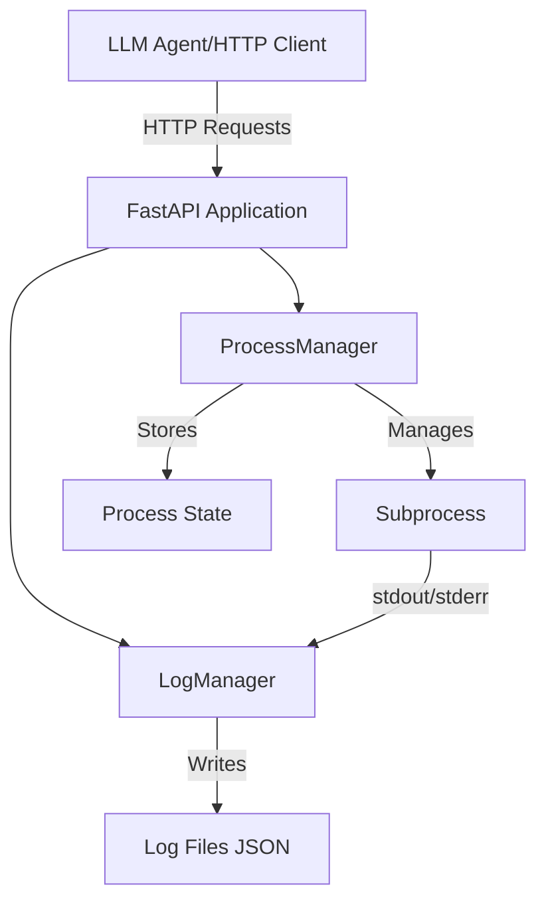
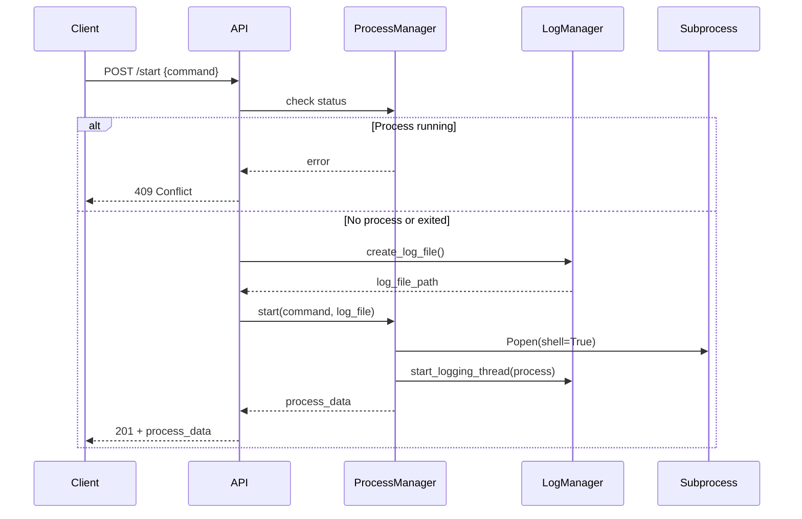
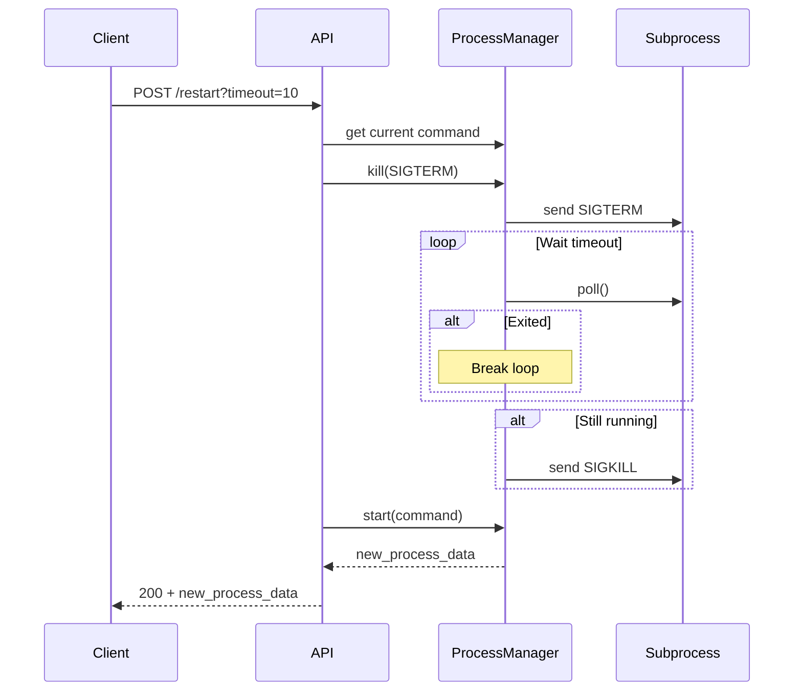
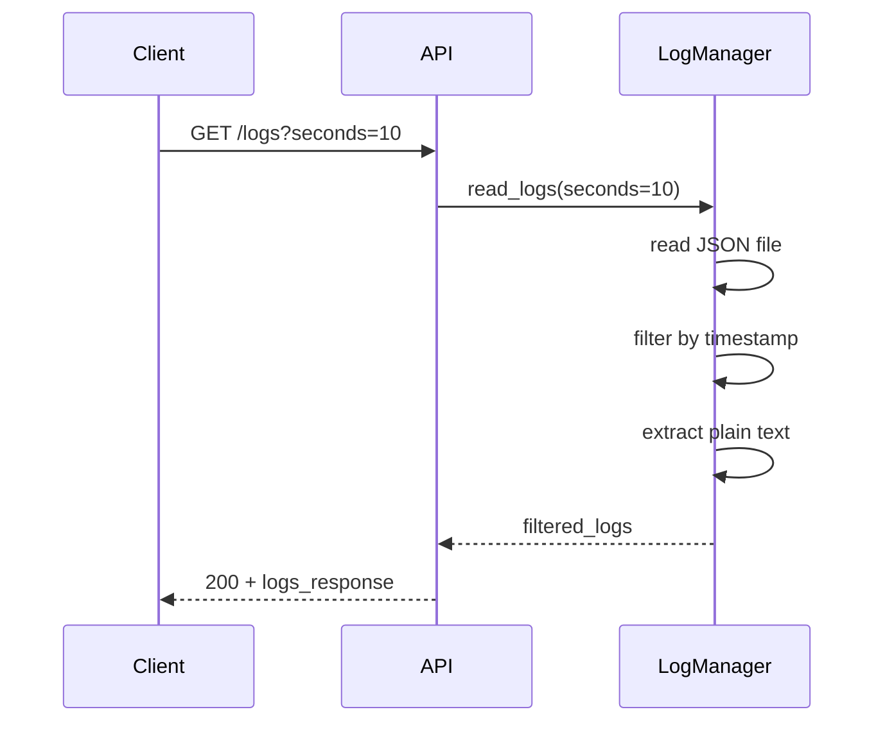

# LLM Shell - Архитектура проекта

## Обзор

HTTP API сервер для управления одиночным процессом в неблокирующем режиме. Предназначен для использования LLM-агентами, которым нужно запускать серверы, тесты, смотреть логи и перезапускать процессы без блокировки собственной консоли.

## Ключевые принципы

- **Одна сессия**: аналог одного окна терминала, только один процесс может быть запущен
- **Неблокирующее взаимодействие**: все операции через HTTP API
- **Простота**: никаких сложных абстракций, управления сессиями, очистки логов
- **Локальное использование**: без авторизации, CORS и других механизмов защиты

## Технологический стек

- **Runtime**: Python 3.8+
- **Web Framework**: FastAPI (быстрый, современный, с автогенерацией OpenAPI)
- **Process Management**: `subprocess.Popen` с `shell=True`
- **Logging**: JSON файлы на диске
- **Configuration**: Environment variables + CLI arguments

## Архитектура компонентов



## Структура проекта

```
llm_shell/
├── src/
│   ├── __init__.py
│   ├── main.py              # FastAPI app и endpoints
│   ├── process_manager.py   # Управление subprocess
│   ├── log_manager.py       # Управление логами
│   ├── models.py            # Pydantic модели для API
│   └── config.py            # Конфигурация приложения
├── tests/
│   ├── __init__.py
│   ├── test_process_manager.py
│   ├── test_log_manager.py
│   └── test_api.py
├── logs/                    # Директория для лог-файлов
├── requirements.txt
├── README.md
└── .gitignore
```

## Компоненты

### 1. ProcessManager

**Ответственность**: управление единственным subprocess

**Состояние**:
```python
{
    "command": str,
    "status": "running" | "exited" | "killed",
    "pid": int | None,
    "created_at": datetime,
    "stopped_at": datetime | None,
    "exit_code": int | None,
    "log_file": str
}
```

**Методы**:
- `start(command: str) -> dict`: запускает процесс
- `get_status() -> dict`: проверяет статус (poll)
- `kill(signal_type: str) -> dict`: убивает процесс (SIGTERM/SIGKILL)
- `restart(timeout: int) -> dict`: перезапускает процесс

**Детали реализации**:
- Использует `subprocess.Popen(command, shell=True, stdout=PIPE, stderr=STDOUT)`
- При старте проверяет: если процесс running → ошибка 409, если exited → разрешает
- `poll()` вызывается при каждом запросе статуса для проверки жизни процесса
- Рабочая директория = текущая директория API сервера
- Restart: посылает SIGTERM, ждет timeout секунд, если не завершился → SIGKILL

### 2. LogManager

**Ответственность**: сбор и хранение логов процесса

**Формат хранения** (JSON Lines):
```json
{"timestamp": "2026-02-16T03:00:00.123Z", "line": "Server starting on port 8080"}
{"timestamp": "2026-02-16T03:00:01.456Z", "line": "Request received"}
```

**Формат отдачи** (plain text):
```
Server starting on port 8080
Request received
```

**Методы**:
- `create_log_file() -> str`: создает новый лог-файл с timestamp именем
- `write_log(process: Popen)`: читает stdout/stderr и пишет в JSON файл с flush
- `read_logs(lines: int | None, seconds: int | None) -> dict`: читает логи

**Детали реализации**:
- Имя файла: `logs/YYYY-MM-DD_HH-MM-SS.log`
- Запись в реальном времени через thread, читающий process.stdout
- При записи: `file.write(json.dumps({...}) + "\n"); file.flush()`
- При чтении с `lines`: берем последние N строк
- При чтении с `seconds`: фильтруем по timestamp (текущее время - N секунд)
- При чтении без параметров: все строки
- Ошибка если указаны и `lines` и `seconds` одновременно

### 3. FastAPI Application

**Endpoints**:

#### POST /start
- Принимает: `{"command": "string"}`
- Валидирует: команда не пустая
- Проверяет: нет ли уже running процесса
- Создает: новый лог-файл
- Запускает: процесс
- Возвращает: 201 + данные процесса

#### GET /status
- Проверяет: poll() процесса
- Обновляет: статус если завершился
- Возвращает: 200 + данные процесса

#### POST /kill
- Query param: `type=SIGTERM|SIGKILL`
- Валидирует: есть ли running процесс
- Убивает: соответствующим сигналом
- Возвращает: 200 + данные остановки

#### POST /restart
- Query param: `timeout=10` (опционально, default=10)
- Останавливает: SIGTERM, ждет timeout, затем SIGKILL если нужно
- Запускает: тот же command
- Создает: новый лог-файл (новый timestamp)
- Возвращает: 200 + данные нового процесса

#### GET /logs
- Query params: `lines` XOR `seconds` (не оба сразу)
- Валидирует: параметры
- Читает: из JSON файла
- Фильтрует: по условию
- Возвращает: 200 + plain text логи

#### GET /health
- Возвращает: 200 + `{"status": "healthy", "version": "1.0.0", "uptime": seconds}`

### 4. Configuration

**Переменные окружения**:
- `LLM_SHELL_PORT`: порт API сервера (default: 8000)
- `LLM_SHELL_HOST`: хост API сервера (default: 0.0.0.0)

**CLI аргументы**:
```bash
python -m src.main --port 8000 --host 127.0.0.1
```

## Обработка ошибок

### HTTP коды ошибок:

- **400 Bad Request**: 
  - Пустая команда
  - Одновременно указаны lines и seconds
  - Некорректные параметры

- **404 Not Found**:
  - Процесс не запущен (при запросе status/kill/restart)
  - Лог-файл не найден

- **409 Conflict**:
  - Попытка запустить процесс когда уже running

- **500 Internal Server Error**:
  - Ошибка при запуске процесса
  - Ошибка при работе с логами

### Формат ошибок:
```json
{
  "error": "Process already running"
}
```

## Модели данных (Pydantic)

```python
class StartRequest(BaseModel):
    command: str

class ProcessStatus(BaseModel):
    command: str
    status: Literal["running", "exited", "killed"]
    created_at: datetime
    process_pid: int | None
    log_file: str
    stopped_at: datetime | None = None
    exit_code: int | None = None

class KillResponse(BaseModel):
    stopped_at: datetime
    exit_code: int
    type: Literal["SIGTERM", "SIGKILL"]
    status: Literal["killed"]

class LogsResponse(BaseModel):
    log_file: str
    total_lines: int
    lines_returned: int
    content: str

class HealthResponse(BaseModel):
    status: Literal["healthy"]
    version: str
    uptime: int
```

## Потоки выполнения

### Поток 1: Запуск процесса



### Поток 2: Перезапуск процесса



### Поток 3: Чтение логов



## Особенности реализации

### Thread-safety
- ProcessManager хранит состояние одного процесса → не нужна синхронизация между запросами
- LogManager пишет в один файл из одного thread → нужен lock при записи
- FastAPI async handlers + sync managers = без проблем

### Логирование процесса
Thread который читает stdout процесса:
```python
def _log_reader_thread(process, log_file):
    with open(log_file, 'a') as f:
        for line in iter(process.stdout.readline, b''):
            log_entry = {
                "timestamp": datetime.utcnow().isoformat() + 'Z',
                "line": line.decode('utf-8').rstrip()
            }
            f.write(json.dumps(log_entry) + '\n')
            f.flush()
```

### Graceful shutdown
При остановке API сервера:
1. Если процесс running → отправить SIGTERM
2. Подождать 5 секунд
3. Если не завершился → SIGKILL
4. Закрыть все файлы логов

## Тестирование

### Unit тесты

**test_process_manager.py**:
- Запуск простой команды (`echo "test"`)
- Запуск долгой команды (`sleep 10`)
- Проверка статуса running/exited
- Kill с SIGTERM
- Kill с SIGKILL
- Restart процесса
- Ошибка при двойном старте

**test_log_manager.py**:
- Создание лог-файла
- Запись логов
- Чтение всех логов
- Чтение N последних строк
- Чтение за последние N секунд
- Ошибка при одновременных lines и seconds

**test_api.py**:
- Все endpoints с корректными данными
- Все endpoints с некорректными данными
- Проверка HTTP кодов
- Проверка формата ответов
- Сценарий: start → status → kill
- Сценарий: start → restart → status
- Сценарий: start → logs → kill

### Integration тесты

- Запуск реального HTTP сервера
- Запуск тестов через LLM Shell
- Проверка логов сервера
- Перезапуск сервера
- Повторный запуск тестов

## Зависимости

```
fastapi>=0.110.0
uvicorn[standard]>=0.27.0
pydantic>=2.6.0
pytest>=8.0.0
httpx>=0.26.0
```

## Примеры использования

### 1. Запуск веб-сервера и тестов

```bash
# Запуск API
python -m src.main

# В другом терминале или через HTTP клиент

# Запускаем веб-сервер
curl -X POST http://localhost:8000/start \
  -H "Content-Type: application/json" \
  -d '{"command": "python -m http.server 8080"}'

# Проверяем статус
curl http://localhost:8000/status

# Запускаем тесты (в другом процессе, вне LLM Shell)
pytest tests/

# Смотрим логи сервера
curl 'http://localhost:8000/logs?lines=50'

# Если тест упал - правим код, перезапускаем сервер
curl -X POST 'http://localhost:8000/restart?timeout=5'

# Снова запускаем тесты
pytest tests/

# Завершаем
curl -X POST 'http://localhost:8000/kill?type=SIGTERM'
```

### 2. Использование с переменными окружения

```bash
# Запуск с переменной окружения
curl -X POST http://localhost:8000/start \
  -H "Content-Type: application/json" \
  -d '{"command": "PORT=3000 node server.js"}'
```

### 3. Использование с cd

```bash
# Переход в директорию и запуск
curl -X POST http://localhost:8000/start \
  -H "Content-Type: application/json" \
  -d '{"command": "cd myapp && npm start"}'
```

## Ограничения и известные проблемы

1. **Один процесс**: нельзя запустить несколько процессов параллельно
2. **Shell injection**: использование `shell=True` небезопасно для ненадежного ввода (но это локальный инструмент)
3. **Нет персистентности**: при перезапуске API сервера состояние теряется
4. **Нет ротации логов**: файлы могут вырасти до большого размера
5. **Кодировка**: предполагается UTF-8 для stdout/stderr процесса

## Будущие улучшения (опционально)

- Поддержка нескольких процессов через session_id
- WebSocket для streaming логов
- Персистентность состояния в SQLite
- Автоматическая ротация логов
- Метрики (CPU, память процесса)
- Dashboard для визуализации
