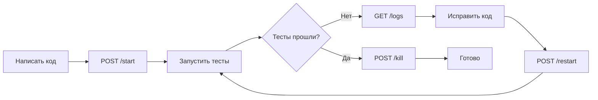

# LLM Shell - Краткая сводка проекта

## Что это?

HTTP API для управления одиночным процессом в неблокирующем режиме. Разработано специально для LLM-агентов, чтобы они могли:
- Запускать серверы не блокируя себе консоль
- Смотреть логи запущенного процесса
- Убивать и перезапускать процессы
- Итеративно разрабатывать и тестировать

## Ключевые особенности

✅ Простой HTTP API (FastAPI)  
✅ Одна сессия = один процесс  
✅ Логи в JSON формате на диске  
✅ Неблокирующее взаимодействие  
✅ Shell команды через `shell=True`  
✅ Graceful restart с таймаутом  
✅ Фильтрация логов по времени/строкам  

## Технологии

- Python 3.8+
- FastAPI + Uvicorn
- subprocess + threading
- Pydantic для валидации
- pytest для тестов

## API Endpoints (6 штук)

| Method | Endpoint | Описание |
|--------|----------|----------|
| POST | /start | Запустить процесс |
| GET | /status | Статус процесса |
| POST | /kill | Убить процесс (SIGTERM/SIGKILL) |
| POST | /restart | Перезапустить процесс |
| GET | /logs | Получить логи (lines/seconds) |
| GET | /health | Health check |

## Структура файлов

```
llm_shell/
├── src/
│   ├── main.py              # FastAPI app + endpoints
│   ├── process_manager.py   # Управление subprocess
│   ├── log_manager.py       # JSON логи
│   ├── models.py            # Pydantic модели
│   ├── config.py            # Конфигурация
│   └── exceptions.py        # Кастомные исключения
├── tests/
│   ├── test_process_manager.py
│   ├── test_log_manager.py
│   └── test_api.py
├── logs/                    # Лог-файлы (auto-created)
├── plans/                   # Документация архитектуры
├── requirements.txt
└── README.md
```

## Основные компоненты

### ProcessManager
- Управляет одним subprocess.Popen
- Статусы: running, exited, killed
- Методы: start(), get_status(), kill(), restart()
- Проверка через poll() при каждом запросе

### LogManager
- Пишет логи в JSON: `{"timestamp": "...", "line": "..."}`
- Отдает plain text
- Thread для чтения stdout/stderr в реальном времени
- Фильтрация по lines (последние N) или seconds (за N секунд)

### FastAPI App
- 6 endpoints по спецификации
- Обработка ошибок: 400, 404, 409, 500
- Lifecycle events для graceful shutdown
- Конфигурация через ENV и CLI

## Workflow для LLM агента



## Пример использования

```bash
# 1. Запустить сервер
curl -X POST http://localhost:8000/start \
  -H "Content-Type: application/json" \
  -d '{"command": "python -m http.server 8080"}'

# 2. Проверить статус
curl http://localhost:8000/status

# 3. Запустить тесты (в своей консоли)
pytest tests/

# 4. Посмотреть логи сервера
curl 'http://localhost:8000/logs?lines=50'

# 5. Перезапустить если нужно
curl -X POST 'http://localhost:8000/restart?timeout=5'

# 6. Остановить
curl -X POST 'http://localhost:8000/kill?type=SIGTERM'
```

## Конфигурация

### Переменные окружения
```bash
export LLM_SHELL_PORT=8000
export LLM_SHELL_HOST=0.0.0.0
```

### CLI аргументы
```bash
python -m src.main --port 8000 --host 127.0.0.1
```

## Детали логирования

### Внутреннее хранение (JSON)
```json
{"timestamp": "2026-02-16T03:00:00.123Z", "line": "Server starting"}
{"timestamp": "2026-02-16T03:00:01.456Z", "line": "Request received"}
```

### Отдача через API (plain text)
```
Server starting
Request received
```

### Имя файла
```
logs/2026-02-16_03-00-00.log
```
(timestamp времени запуска процесса)

## Обработка ошибок

| Код | Когда | Пример |
|-----|-------|--------|
| 400 | Некорректный запрос | Пустая команда, lines+seconds одновременно |
| 404 | Ресурс не найден | Процесс не запущен, лог-файл не найден |
| 409 | Конфликт состояния | Процесс уже запущен (при /start) |
| 500 | Внутренняя ошибка | Ошибка запуска процесса, ошибка работы с файлом |

## Тестирование

### Unit тесты
- ProcessManager: start, status, kill, restart
- LogManager: create, write, read, filter
- Моки и fixtures для subprocess

### Integration тесты
- Все endpoints с реальными командами
- E2E сценарии: start → logs → restart → kill
- Проверка HTTP кодов и форматов ответов

## Запуск проекта

```bash
# Установка
pip install -r requirements.txt

# Разработка (с hot-reload)
uvicorn src.main:app --reload

# Prod
python -m src.main

# Тесты
pytest -v

# Coverage
pytest --cov=src tests/
```

## Ограничения

⚠️ Только один процесс одновременно  
⚠️ Нет персистентности (при перезапуске API теряется состояние)  
⚠️ Нет ротации логов  
⚠️ Shell=True небезопасно для публичного API (но это локальный инструмент)  
⚠️ UTF-8 кодировка assumed  

## TODO List (17 задач)

1. ✅ Создать структуру проекта
2. ✅ Определить модели данных
3. ⏳ Реализовать ProcessManager
4. ⏳ Реализовать LogManager
5. ⏳ FastAPI app + /health
6. ⏳ Endpoint /start
7. ⏳ Endpoint /status
8. ⏳ Endpoint /kill
9. ⏳ Endpoint /restart
10. ⏳ Endpoint /logs
11. ⏳ Обработка ошибок
12. ⏳ Конфигурация
13. ⏳ Unit тесты ProcessManager
14. ⏳ Unit тесты LogManager
15. ⏳ Integration тесты API
16. ⏳ README
17. ⏳ requirements.txt

## Зависимости (requirements.txt)

```
fastapi>=0.110.0
uvicorn[standard]>=0.27.0
pydantic>=2.6.0
pydantic-settings>=2.0.0
pytest>=8.0.0
pytest-cov>=4.1.0
httpx>=0.26.0
```

## Следующие шаги

После утверждения архитектуры:
1. Переключиться в Code mode
2. Создать структуру проекта
3. Реализовать компоненты по todo list
4. Написать тесты
5. Протестировать с реальными сценариями
